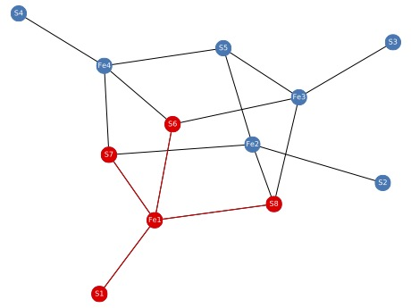
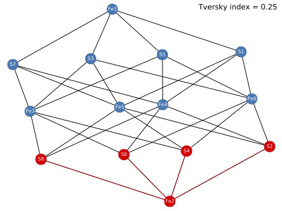

# `como`

## Comparing two molecular graphs based on their maximum common connected edge subgraph

This python code compares two molecular graphs by computing their maximum common connected edge subgraph (MCCES). Our method is based on an integer linear programming formulation for the maximum common edge subgraph problem [[1]](#1), to which we added connectivity constraints defined on the line graphs of both molecular graphs. We also added optional functionality to restrict the atom mappings to labels (e.g., identical coordination values). We used the number of MCCES edges to compute the Tversky index [[2]](#2) , which generalizes the Sorensen-Dice index and is more appropriate for local matching.  We implemented the algorithms in Python, using the networkx library and used Gurobi 9.1 to solve the underlying mathematical optimization problem.

The code is based on code written by Jan Seipp [[3]](#3) for the maximum common edge subgraph problem [[1]](#1) (without connectivity constraints). 

## References   

<a id="1">[1]</a>  Bahiense, L., Manić, G., Piva, B. & De Souza, C. C. The maximum common edge subgraph problem: A polyhedral investigation. Discret. Appl. Math.160, 2523–2541 (2012).

<a id="1">[2]</a> Tversky, A. Features of similarity. Psychol. Rev.84, 327–352 (1977).

<a id="1">[3]</a> Seipp, J. Fast Maximum Common Edge Subgraph Computation for Comparing Similar Molecular Structures. Master's thesis, Heinrich Heine University Düsseldorf, Germany (2021).

## Dependencies

You need to install the following python packages and have a Gurobi license key:

```
optparse
networkx
pandas
matplotlib
gurobipy
```

## Usage

The molecular graphs are given in `csv` format. For each graph `example` there are two files: `example_vert.csv` and `example_edges.csv`. The file formats are as follows (explained by example):

Vertex file (first lines, example):

``` 
idx,elem,CN,id
0,S,4,S1
1,S,4,S2
...
```

Here, `idx` is a unique numerical index for the atom, `elem` denotes the chemical element (here, sulfur), `CN` is the coordination number, and `id` is a unique label for the atom.

Edge file (first lines, example):

```
Source,Target
0,8
1,9
2,10
```

Each line represents an edge, given by source and target `idx` of the corresponding vertices.

```
python como.py -h
Usage: como.py [options]

Options:
  -h, --help          show this help message and exit
  -p P                protein cofactor [sf4_sg]
  -m M                mineral quotient graph [greigite]
  -c, --coordination  consider coordination [false]
```

The output are six files. Four `csv` files extend the vertex and edge files by adding a columns indicating whether the corresponding vertex/edge is part of the MCCES. In addition, there are two `pdf` files, visualizing the MCCES within each original graph and giving the Tversky index in the upper right corner. Here are examples of such output `pdf` files for the corresponding input files:





## Author
Gunnar W. Klau (gunnar.klau@hhu.de)
